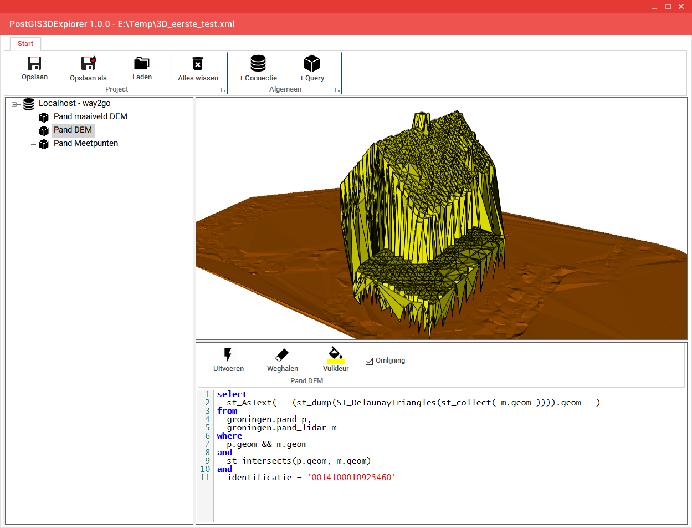

# PostGIS3DExplorer

The PostGIS 3D Explorer tool makes it easier to test the various 3D capabilities of PostGIS by visualising the results of queries returning 3D geomeries.
You can connect to one or more PostGIS databases and visualise the results directly!

Prerequisites:
- PostgreSQL 9.6+ (maybe older versions will work)
- PostGIS 2.2+ (maybe older versions will work)
- Windows 7 or higher
- .NET Framework 4.6.1

To get started quickly, download a [compiled release](../../releases)!
The interface is Dutch for now, an English version is still a to-do.

Building instructions:
To build this project in Visual Studio 2017+ you need a binary copy of vtk 7, you can find a copy here:
https://github.com/dearman/activizdotnet
